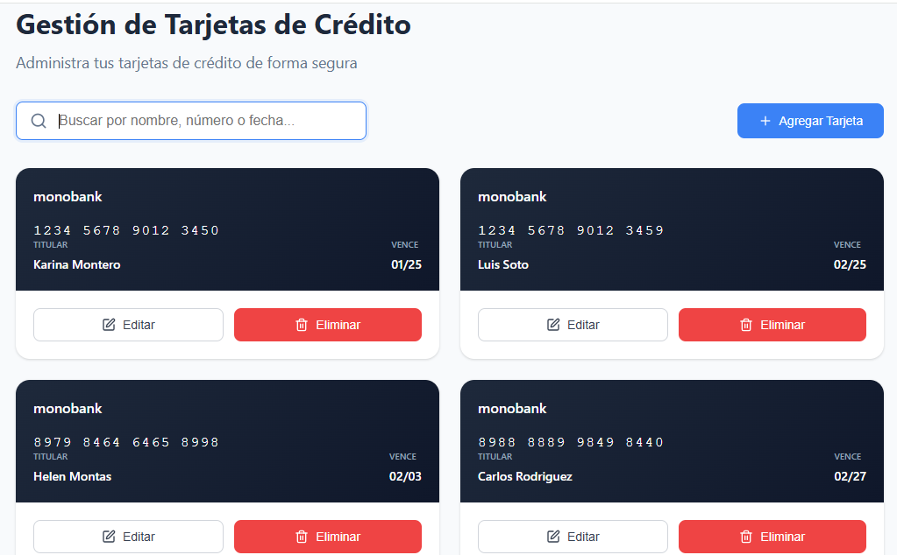

## 💳 Card Manager Frontend

Interfaz web para la gestión de tarjetas de crédito, conectada a la API RESTful [CARD-API](https://github.com/tu-usuario/add-card-api). Permite visualizar, crear, editar y eliminar tarjetas con validación en tiempo real.

---

## 📸 Vista previa



---

## ⚙️ Tecnologías utilizadas

* React 18 + Vite
* TypeScript
* React Hook Form + Yup
* Lucide (iconos)
* Sonner (notificaciones)
* Fetch API
* CSS personalizado / TailwindCSS (opcional)

---

## 🚀 Funcionalidades

* 📥 Agregar tarjeta con validación de datos
* ✏️ Editar tarjeta existente
* ❌ Eliminar tarjeta
* 🔍 Buscar por nombre, número o fecha
* 💳 Vista previa del diseño de la tarjeta en tiempo real
* ⚙️ Integración con API RESTful

---

## 📦 Instalación

1. **Clona el repositorio**

```bash
git clone https://github.com/tu-usuario/card-frontend.git
cd card-frontend
```

2. **Instala dependencias**

```bash
npm install
```

3. **Ejecuta la aplicación**

```bash
npm run dev
```

La app estará disponible en:

📍 [http://localhost:5173](http://localhost:5173)

> Asegúrate de que la API esté corriendo en [http://localhost:3000](http://localhost:3000)

---

## 🔗 Conexión con la API

Actualmente la app hace peticiones a:

```
http://localhost:3000/cards
```

Puedes cambiar esa URL en el archivo:

```
src/hooks/useCardManager.ts
```

---

## 🗂️ Estructura del proyecto

```
src/
├── components/         # Componentes UI
├── hooks/              # Lógica de negocio (gestión de tarjetas)
├── schemas/            # Esquemas de validación con Yup
├── types/              # Interfaces y tipos TypeScript
├── App.tsx             # Componente principal
├── main.tsx            # Punto de entrada de Vite
├── App.css             # Estilos generales
```

---

## ✍️ Autor

Karina Montero Leonardo

---

## 📄 Licencia

MIT

---